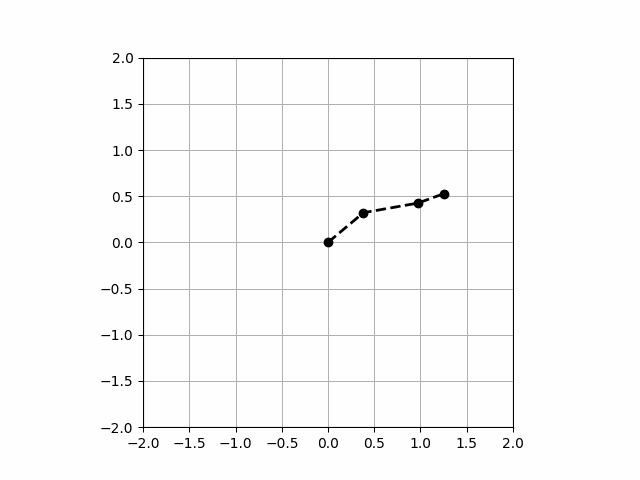

# Project Arm
A cheap servo controlled arm with vision system and ROS2 integration :-).

## UI in ubuntu

Run 
    xhost +

    

## Connection issues

    sudo ufw allow in proto udp to 224.0.0.0/4

    sudo ufw allow in proto udp from 224.0.0.0/4

Make sure Raspi is using the right network infterface (eth0/wlan0)

### Multicast Addresses

Class D addresses (224.0.0.0 – 239.255.255.255) are assigned to multicast. So the first 4 bits of a multicast address should be 1110 and the remaining 28 bits represent different goups. Some addresses are reserved and have been assigned to specified groups. For example,

    224.0.0.1 – all hosts group, all hosts configured IP multicast will join this group when an interface starts up.
    224.0.0.2 – all multicast routers group
    224.0.0.22 – IGMP Multicast router. An IGMP member report will be sent this addresses when a host joins a multicast group, then the multicast router can receive that report and maitain the membership of a group. We can capture the following packet when a program join the multicast group 225.0.0.37.

Enabling multicast on an IP address

1. To check if multicast is enabled already on an IP address use the “ifconfig” command.

# ifconfig eth0 | grep -i multi
          UP BROADCAST RUNNING MULTICAST  MTU:1500  Metric:1

Note : Please replace ethX with appropriate Ethernet. If multicast is enabled, a flag will be displaying.

2. To disable multicast on a spcific ip/interface:

# ifconfig ethX -multicast

3. To enable multicast on a specific ip/interface :

# ifconfig ethX multicast

Listing IPs subscribed to a multicast group

In order to look at the IP address which has subscribed the multicast group, one can take a look at in the content of following file /proc/net/igmp. For example:

# cat /proc/net/igmp
Idx	Device    : Count Querier	Group    Users Timer	Reporter
1	lo        :     1      V3
				010000E0     1 0:00000000		0
2	eth0      :     1      V3
				010000E0     1 0:00000000		0

Based on multicast application, IP will be receiving or transferring packets.